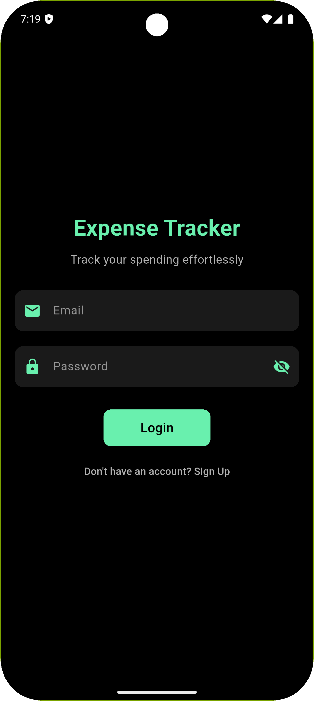
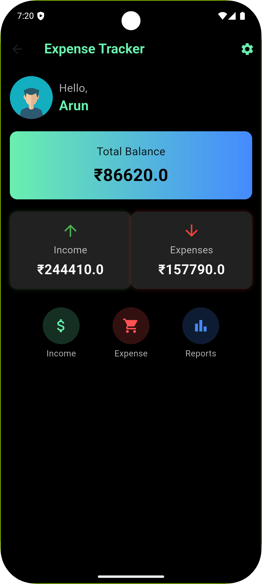
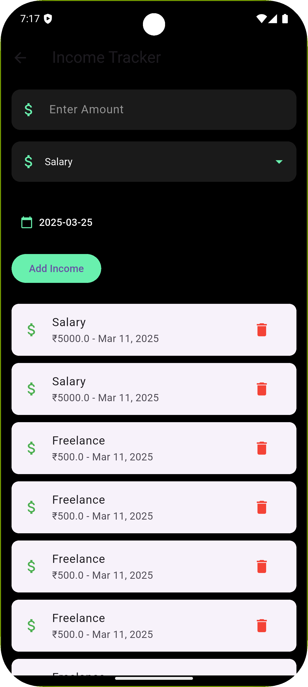
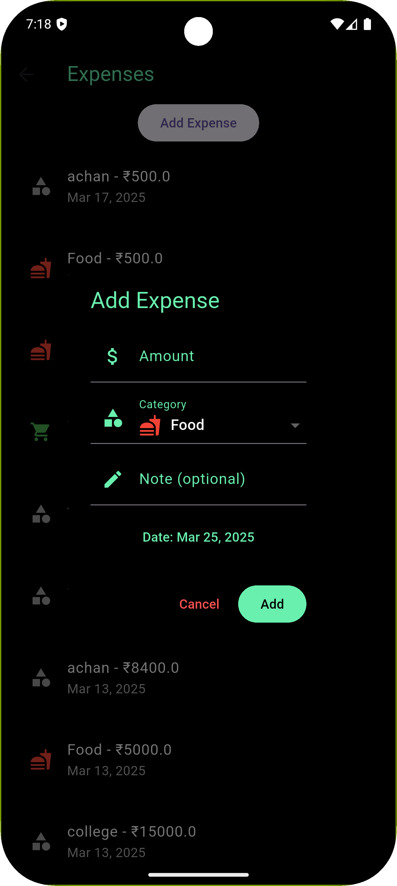
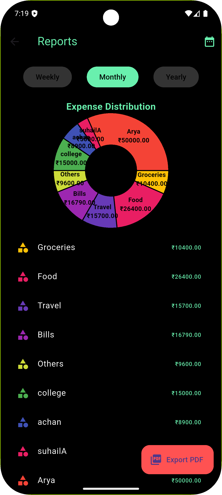

# 💸 Expense Tracker App

A modern and intuitive **Flutter-based Expense Tracker App** with Firebase integration. Designed to help users manage and visualize their income and expenses efficiently. Built with love 💚 by (www.linkedin.com/in/raaahul).


---

## 🚀 Features

- ✅ Add & manage **Income** and **Expenses**
- ✅ Real-time **Firebase Firestore** sync
- ✅ Category-wise inputs (Food, Travel, Business, etc.)
- ✅ **Pie Chart & Bar Chart** reports using Syncfusion
- ✅ Monthly summaries & filters
- ✅ User profile with editable name & avatar (He/She)
- ✅ Firebase Authentication
- ✅ Clean, futuristic UI with animations
- ✅ Mobile + Web responsive UI

---

## 📸 Screenshots

| Login Screen | Home Screen | Add Income | Add Expense | Reports |
|-------------|------------|--------------|--------------|---------|
| |  |  |  |  |

---

## 🧪 Tech Stack

| Layer | Tools |
|-------|-------|
| 💻 Frontend | Flutter (Dart) |
| 🔥 Backend | Firebase (Auth, Firestore) |
| 📊 Charts | Syncfusion Flutter Charts |
| 🎨 State Management | Provider |
| 🌐 Platform | Android, ios, Web (Responsive) |

---
## 🚀 Download & Try

📱 Download APK  (https://drive.google.com/drive/folders/1ctgn-u0bgCbs3iwF8XhAC_f4444YpEQz?usp=sharing)

## 🛠️ Installation

```bash
git clone https://github.com/raaahul2003/expense_tracker.git
cd expense_tracker
flutter pub get
flutter run

---


